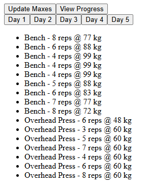
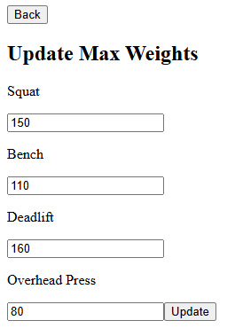
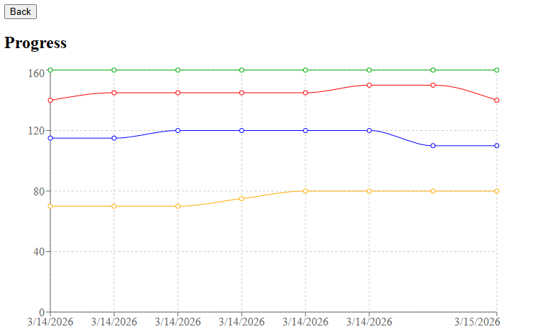

# Workout tracker
A full stack web application for tracking workout progress. User can store their one rep maxes and the application 
will generate workouts for them.

This application was built to practice full stack web development. I wanted to refresh developing with React, Node.js and MongoDB.

Live demo:
If the application does not work instantly, the backend is sleeping on render. First request will start the backend and the application will work after 1-2 minutes.
https://workout-tracker-e4a5.onrender.com/

## Tech stack:
Frontend
- React (Vite)
- Axios

Backend
- Node.js
- Express

Database
- MongoDB Atlas
- Mongoose

Deployment
- Render

## How it works
The application stores user data in MongoDB.  
Each user has:

- current one-rep maxes
- a history of previous max weights

When maxes are updated:
1. The new values are saved
2. A history entry is created
3. The progress graph updates automatically

Workout weights are calculated dynamically in the frontend based on the stored max values.

## Screenshots

